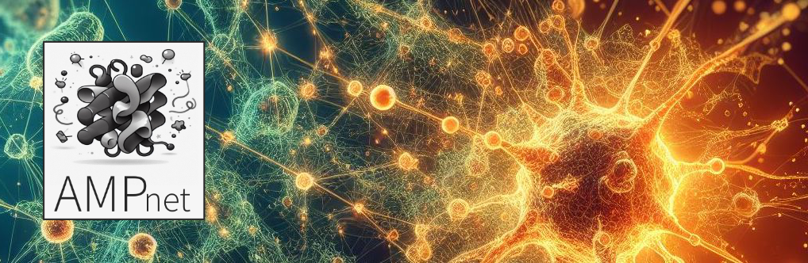
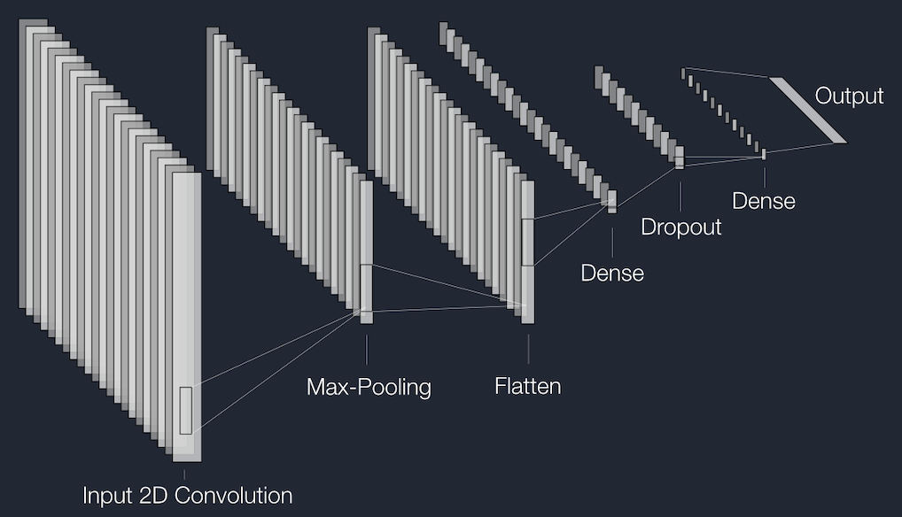
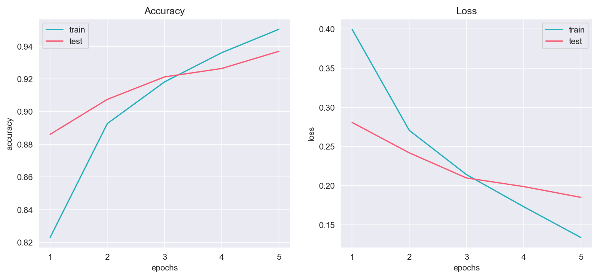
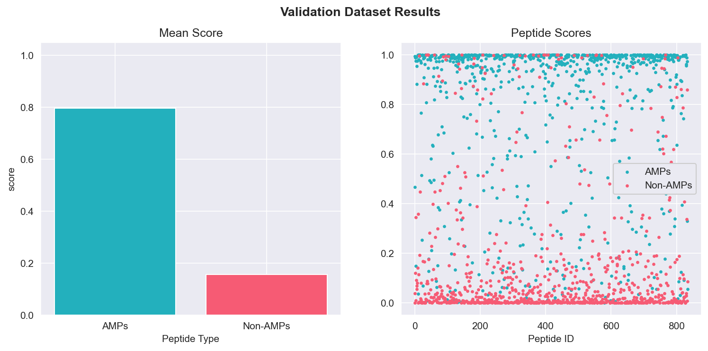
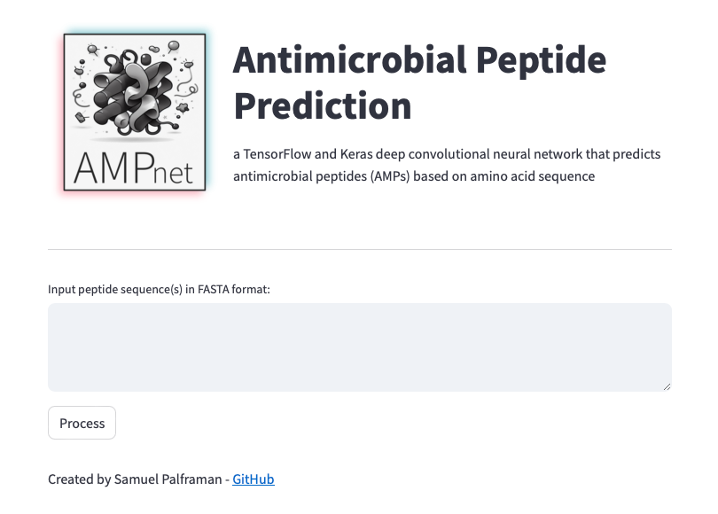
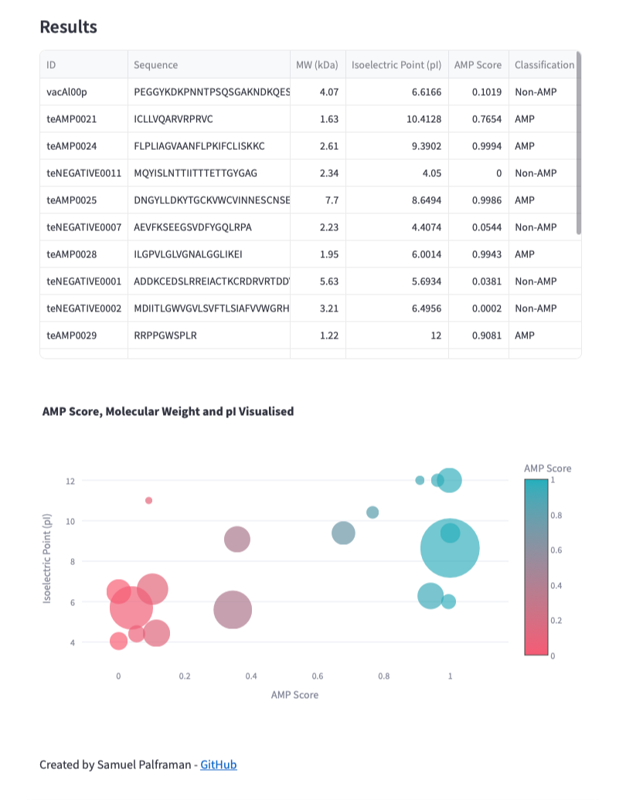

# AMPnet: Antimicrobial Peptide Prediction
TensorFlow and Keras Deep Convolutional Neural Network (ConvNet) that identifies Antimicrobial Peptides (AMPs) based on Amino Acid Sequences.

Created and submitted as final project for Monash University Data Analytics Boot Camp (November 2023). 




## Preface

Antibiotic-resistant bacteria have emerged as one of the greatest threats to human health globally. By the year 2050, there will be more deaths attributed to antibiotic-resistant bacterial infections than cancer each year. Our overuse and over-reliance on antibiotics has, over time, dramatically reduced their effectiveness and efficacy ([Murray et al. 2022](https://www.sciencedirect.com/science/article/pii/S0140673621027240?pes=vor)). As such, the development of new and alternative antimicrobial therapies is essential to human health long-term. 

Antimicrobial peptides (AMPs) possess broad-spectrum antimicrobial properties and are considered a promising substitute for current antibiotics ([Xuan et al. 2023](https://www.sciencedirect.com/science/article/pii/S1368764623000377#bib84)). However, screening unknown and/or putative AMPs in wet laboratories can be time-consuming, expensive and difficult to implement large-scale. An alternative and more rapid approach is to use Deep Neural Network Machine Learning to identify peptides that possess antimicrobial properties based on various features. 

This project uses a Deep Convolutional Neural Network Model to classify peptides as AMPs or Non-AMPs based on amino acid sequence. 

## Using AMPnet

Click [**here**](https://antimicrobial-neural-network-app-palframan.streamlit.app) to use AMPnet.

## Table of Contents

- [Instructions](#instructions)
- [General info](#general-info)
- [Technologies](#technologies)
- [Screenshots](#screenshots)
- [Code example](#code-example)
- [Repository structure](#repository-structure)
- [References](#references)

## General info

### AMPnet_functions.py

- Defines **Functions** called in Python Flask file (`app.py`):
  - `process_fasta(user_input)`: parses FASTA Input from user and converts it to Pandas DataFrame.
  - `bin_aa(sequence)`: bins Amino Acids based on Amino Acid Murphy 8 categories (unused in final version).
  - `calc_molecular_weight(sequence)`: calculates Molecular Weights (in kDa) of Amino Acid Sequences (as pd.Series).
  - `list_hydrophobicities(sequence)`: lists Kyte-Doolittle scores for each amino acid in sequence.
  - `calculate_pI(sequences)`: calculates Isoelectric Point (pI) of Amino Acid Sequence (as pd.Series).
  - `one_hot_encode(sequence)`: One-Hot Encodes Amino Acid Sequence.
  - `pad_arrays(arr_list, desired_len)`: Pads One-Hot-Encoded Array Sequences.
  - `create_bubble_chart(df)`: creates Plotly Bubble Chart to visualise AMP Score, MW and pI in results.html.


### AMPnet.py

- Takes `FASTA Input sequence(s)` from User via `index.html`.
- Serves Input data to `/process_text` app route where all Functions in `AMP_functions.py` are called.
- Returns `results_df` DataFrame and `results_df` Bubble Chart to `result.html` page.
- Catches errors and renders `error.html` if input from user is not a valid FASTA amino acid sequence.

**Simplified LeNet Diagram**:



**Accuracy and Loss of Train and Test data**:



Test Accuracy: `93.69 %` / Test Loss: `0.18`

**Putative and Confirmed AMP / Non-AMPs predicted by AMPnet**:



*note: score > 0.5 = AMP | score < 0.5 = Non-AMP*

### HDF5_files Folder

- Contains the trained `convolutional_nn_1.h5` AMPnet Model File.

### Resources Folder

- Contains Images of Images, Charts and Model Diagrams.

## Technologies

Project created and run using:

- Python 3.10.9
  - Pandas 1.5.3
  - NumPy 1.24.3
  - Biopython 1.78
  - Matplotlib 3.7.1
  - Plotly 5.9.0
  - Seaborn 0.12.2
  - Scikit-Learn 1.3.0
  - TensorFlow 2.14.0
  - Streamlit 1.32.2
- Visual Studio Code 1.83.0


## Screenshots

**Landing Page**



**Results Page**



## Code example

```python
## Code Snippet from AMPnet.py
#################################################

# Function to process the input text
def process_text(user_text):
    try:
        # Process FASTA input from User into Pandas DataFrame
        user_text_df = AMPnet_functions.process_fasta(user_text)

        # Calculate Molecular Weight of Peptides
        user_text_df['MW (kDa)'] = AMPnet_functions.calc_molecular_weight(user_text_df['Sequence'])

        # Calculate Isoelectric Point (pI) of Peptides
        user_text_df['Isoelectric Point (pI)'] = AMPnet_functions.calculate_pI(user_text_df['Sequence'])
        
        # Calculate Hydrophobicity (Kyte-Doolittle Scores) for each Amino Acid
        user_text_df['Hydrophobicity'] = user_text_df['Sequence'].apply(AMPnet_functions.list_hydrophobicities)
        
        # Creae One-Hot Encoded Sequence Column
        user_text_df['One_Hot_Encoded'] = user_text_df['Sequence'].apply(AMPnet_functions.one_hot_encode)
        
        # Set Max Amino Acid Sequence Length
        max_length = 198

        # Pad 'One_Hot_Encoded' Column so that all Matrices are the same size (198 x 20)
        user_text_df['Padded_One_Hot'] = user_text_df['One_Hot_Encoded'].apply
        (lambda arr_list: AMPnet_functions.pad_arrays(arr_list, max_length))

        # Take Values for TensorFlow CNN Model
        user_text_sequences = user_text_df['Padded_One_Hot'].values

        # Convert Input Data to Numpy Array
        user_text_sequences = np.array([np.array(val) for val in user_text_sequences])

        # Load Trained Model
        model = tf.keras.models.load_model('HDF5_files/convolutional_nn_1.h5')
```

## Repository structure

```
.
├── AMPnet.py
├── AMPnet_functions.py
├── HDF5_files
│   └── convolutional_nn_1.h5
├── README.md
├── Resources
│   ├── Images
│   │   ├── AMP_CNN_LeNet.png
│   │   ├── AMP_CNN_structure.png
│   │   ├── ampnet_logo.png
│   │   ├── classification_report.png
│   │   ├── confusion_matrix.png
│   │   ├── convnet_banner_logo.png
│   │   ├── landing_page.png
│   │   ├── model_structure.png
│   │   ├── results_page.png
│   │   ├── training_10_epochs.png
│   │   ├── training_5_epochs_&_dropout.png
│   │   └── validation_5_epochs_&_dropout.png
│   └── fasta_examples.txt
└── __pycache__
    └── AMPnet_functions.cpython-310.pyc
```

## References

- **Data Collation**:
  - Training and Testing data:
    - [Co-AMPpred - Singh et. al. 2021](https://bmcbioinformatics.biomedcentral.com/articles/10.1186/s12859-021-04305-2) 
    - [AI4AMP - Lin et al. 2021](https://pubmed.ncbi.nlm.nih.gov/34783578/)
  
  - Validation data:
    - [AMPlify - Li et al. 2022](https://bmcgenomics.biomedcentral.com/articles/10.1186/s12864-022-08310-4)
  
- **LeNet Diagram generation**:
  - [NN-SVG - LeNail 2019](https://web.archive.org/web/20190428110423id_/https://www.theoj.org/joss-papers/joss.00747/10.21105.joss.00747.pdf)
- Created with assistance from [OpenAI (2023) **ChatGPT**](https://www.openai.com/chatgpt) - Version: GPT-3.5 - November 2023: 
  - Function: `one_Hot_encode(sequence)`; and 
  - Function:`pad_array(arr_list, desired_len)`
  - HTML and CSS code.
  
- Code, where appropriate, was adapted from Monash University Data Analytics Boot Camp 2023 course learning material.

Created and written by Samuel Palframan - November 2023 (Streamlit version created March 2024).
